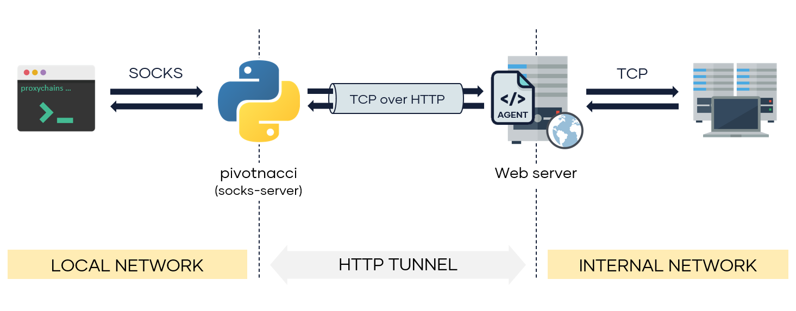

# pivotnacci

[]() []()


Pivot into the internal network by deploying HTTP agents. **Pivotnacci** allows you to create a socks server which communicates with HTTP `agents`. The architecture looks like the following:

<p align="center">
  
</p>

This tool was inspired by the great [reGeorg](https://github.com/sensepost/reGeorg). However, it includes some improvements:
- Support for **balanced servers**
- Customizable polling interval, useful to reduce **detection rates**
- Auto drop connections closed by a server
- Modular and cleaner code
- Installation through pip
- Password-protected agents

Supported socks protocols
------------

- [X] Socks 4
- [X] Socks 5
  + [X] No authentication
  + [ ] User password
  + [ ] GSSAPI

Installation
------------

From python packages:
```shell
pip3 install pivotnacci
```

From repository:
```shell
git clone https://github.com/blackarrowsec/pivotnacci.git
cd pivotnacci/
pip3 install -r requirements.txt # to avoid installing on the OS
python3 setup.py install # to install on the OS
```

Usage
------------

1. Upload the required agent (php, jsp or aspx) to a webserver
2. Start the socks server once the agent is deployed
3. Configure proxychains or any other proxy client (the default listening port for pivotnacci socks server is 1080)

```shell
$ pivotnacci -h
usage: pivotnacci [-h] [-s addr] [-p port] [--verbose] [--ack-message message]
                  [--password password] [--user-agent user_agent]
                  [--header header] [--proxy [protocol://]host[:port]]
                  [--type type] [--polling-interval milliseconds]
                  [--request-tries number] [--retry-interval milliseconds]
                  url

Socks server for HTTP agents

positional arguments:
  url                   The url of the agent

optional arguments:
  -h, --help            show this help message and exit
  -s addr, --source addr
                        The default listening address (default: 127.0.0.1)
  -p port, --port port  The default listening port (default: 1080)
  --verbose, -v
  --ack-message message, -a message
                        Message returned by the agent web page (default:
                        Server Error 500 (Internal Error))
  --password password   Password to communicate with the agent (default: )
  --user-agent user_agent, -A user_agent
                        The User-Agent header sent to the agent (default:
                        pivotnacci/0.0.1)
  --header header, -H header
                        Send custom header. Specify in the form 'Name: Value'
                        (default: None)
  --proxy [protocol://]host[:port], -x [protocol://]host[:port]
                        Set the HTTP proxy to use.(Environment variables
                        HTTP_PROXY and HTTPS_PROXY are also supported)
                        (default: None)
  --type type, -t type  To specify agent type in case is not automatically
                        detected. Options are ['php', 'jsp', 'aspx'] (default:
                        None)
  --polling-interval milliseconds
                        Interval to poll the agents (for recv operations)
                        (default: 100)
  --request-tries number
                        The number of retries for each request to an agent. To
                        use in case of balanced servers (default: 50)
  --retry-interval milliseconds
                        Interval to retry a failure request (due a balanced
                        server) (default: 100)
```

Examples
------------

Using an agent with password `s3cr3t` (`AGENT_PASSWORD` variable must be modified at the agent side as well):
```shell
pivotnacci  https://domain.com/agent.php --password "s3cr3t"
```

Using a custom HTTP `Host` header and a custom `CustomAgent` User-Agent:
```shell
pivotnacci  https://domain.com/agent.jsp -H 'Host: vhost.domain.com' -A 'CustomAgent'
```

Setting a different agent message `418 I'm a teapot` (`ACK_MESSAGE` variable must be modified at the agent side as well):
```shell
pivotnacci https://domain.com/agent.aspx --ack-message "418 I'm a teapot"
```

Reduce detection rate (e.g. WAF) by setting the polling interval to `2` seconds:
```shell
pivotnacci  https://domain.com/agent.php --polling-interval 2000
```

Author
---------------
Eloy Pérez ([@Zer1t0](https://github.com/Zer1t0)) [ [www.blackarrow.net](http://blackarrow.net/) - [www.tarlogic.com](https://www.tarlogic.com/en/) ]


License
-------
All the code included in this project is licensed under the terms of the CC BY-NC-SA 4.0 license.

#

[](https://www.blackarrow.net) [](https://twitter.com/BlackArrowSec) [](https://www.linkedin.com/company/blackarrowsec/)
